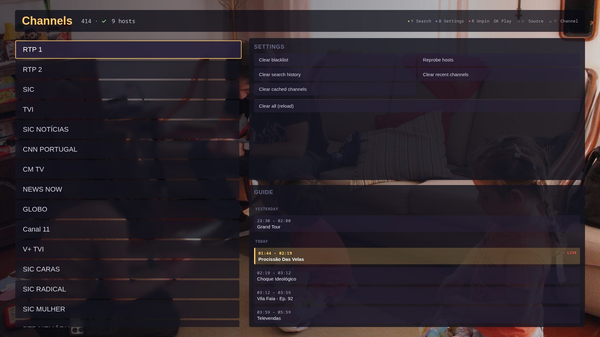
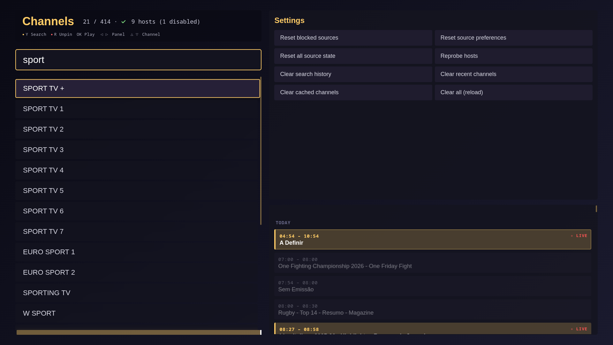
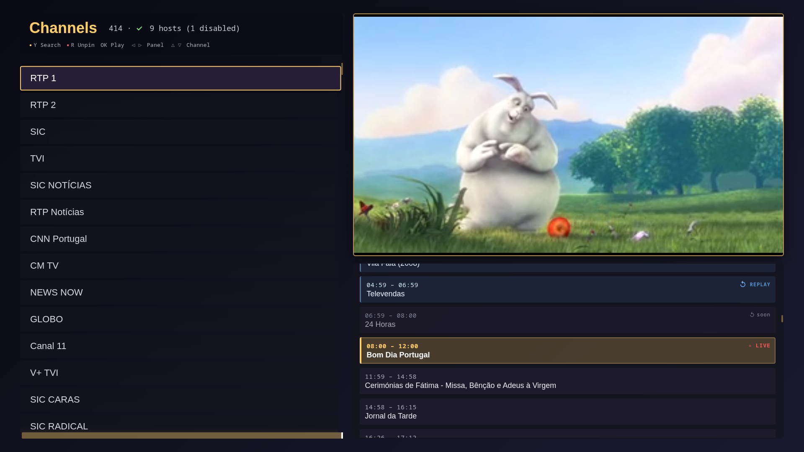

# iptv

Self-hosted IPTV server with a browser UI. Aggregates Xtream Codes providers across multiple hosts, dedupes channels, manages EPG, and proxies live streams with automatic source failover. A webOS app for LG TVs ships in the same repo and reuses the same UI — but the server stands alone: any browser on your LAN is a fully functional client.



## What is this

A standalone IPTV server I built for myself. Personal-scale, no ads, no telemetry, no analytics.

- **The server** (`server/`, Rust) does all the work: probes Xtream hosts in parallel, builds a canonical channel catalog (dedupes across providers, ranks by quality), aggregates EPG, proxies live segments with retries, tracks per-URL / per-host health, and serves the UI as static files. Run it on any Linux box on your LAN.
- **The browser UI** (`app/`, vanilla JS — no framework, no build step) is served directly by the Rust process. Open `http://your-server:8080/` from any device that has a browser and you have a working IPTV client.
- **The webOS app** (same `app/`, packaged as an IPK) is a bonus: the exact same UI, wrapped for LG TVs in Developer Mode so the TV remote drives the experience natively.

## How it works

```
                     ┌──────────────────┐   HTTP   ┌────────────────────┐
   browser  ───────▶ │  iptv-proxy      │ ───────▶ │  Xtream provider   │
                  ┌─▶│  (server/, Rust) │ ◀─────── │  (multiple hosts)  │
   webOS app  ────┘  └──────────────────┘  m3u8/ts └────────────────────┘
                              │
                       serves the UI ·  probe / dedup / EPG / blacklist
```

The server owns everything stateful and operational. Clients (browser or TV) just fetch JSON from `/api/*`, render the list, and point a `<video>` at `/play/<channel>.m3u8` — which the server then proxies, retrying across upstream sources transparently when one fails.

## Features

- Parallel multi-host probing with first-alive-wins boot
- Canonical channel deduplication across providers (RAW / 4K / FHD / HD preference order)
- EPG with multi-source merge, including catch-up (`tv_archive`) support
- Sequential source failover at play time, with per-URL blacklist + per-host demote on repeated failures
- Client-driven feedback: the client reports a URL it failed on; the server learns
- Static-file serving of the same UI used by the webOS app — `http://server:8080/` is a usable client
- Optional LG webOS deployment via `make deploy` (`ares-package` → `scp` → `luna install`)
- Hold-to-scroll with acceleration (380 ms → 45 ms over ~1.5 s)
- Instant render from cache on boot — no spinners

## Screenshots

| Channel list with EPG | Search filter |
| :---: | :---: |
|  |  |
| **Mini overlay while browsing** | **Fullscreen playback** |
|  |  |

The UI is designed for a 1080p TV but renders fine in any browser window. (Playback shots are showing a sample MP4 so the screenshots have actual pixels — Chromium has no native HLS decoder.)

## Quickstart — server (and browser UI)

You need Docker and an Xtream Codes account.

```bash
git clone https://github.com/miguelglopes/iptv.git
cd iptv
cp server/config.example.toml server/config.toml
# Edit server/config.toml — fill in [xtream] username, password, and hosts.

cp app/js/config.example.js app/js/config.js
# Edit app/js/config.js — for the browser UI, set PROXY_BASE_URL = '' (empty = same origin).
# If you point a TV or another machine at the server, set it to the server's LAN URL instead.

docker compose up -d

curl http://localhost:8080/api/status     # should return JSON with `hosts`, `catalog`, etc.
```

Then open **http://localhost:8080/** in any browser. That's the whole UI — channel list, EPG, playback, search, settings.

Keyboard:

| Action | Key |
| --- | --- |
| Move focus | Arrow keys |
| Play / select | Enter |
| Back / exit | Escape or Backspace |
| Search | `y` or `F3` |
| Pin / unpin channel | `r` or `F1` |
| Cycle panels (list / settings / EPG) | `b` or `F4` |
| Next / previous channel | PageUp / PageDown |
| Jump to top / bottom | Home / End |

Configuration lives in `server/config.toml` (gitignored). The example file documents every section: which Xtream hosts to probe, how often, EPG TTL, blacklist thresholds, segment buffer sizes, etc.

## Optional — LG webOS deployment

If you have an LG TV in Developer Mode and want the same UI native on the TV with the remote driving it:

Prereqs:
- LG TV in Developer Mode (ideally with Homebrew Channel for permanence)
- `ares-cli`: `npm i -g @webosose/ares-cli`
- `~/.webos/ose/novacom-devices.json` populated by LG webOS Studio / Dev Manager

```bash
# Edit app/js/config.js so PROXY_BASE_URL points at the server's LAN address.
# (The TV's network resolves this URL itself, so 'http://localhost' won't work — use the LAN IP.)

make setup     # one-time: derive ~/.ssh/lgtv_dev from novacom-devices.json
make deploy    # ~2 s: ares-package → scp IPK → luna install → launch
```

TV remote mapping, deploy internals, and webOS-specific quirks live in [`CLAUDE.md`](CLAUDE.md).

## HTTP API

| Method | Path | Purpose |
|---|---|---|
| `GET`  | `/` (and any unmatched path) | Static UI from `app/` |
| `GET`  | `/api/channels` | Canonical channel list with play URLs and catch-up metadata |
| `GET`  | `/api/epg/:key` | EPG for a channel — server walks all sources in parallel |
| `GET`  | `/api/status` | Hosts / catalog / EPG / blacklist health |
| `POST` | `/api/feedback/:key` | Client tells the server a play failed (`{"kind":"fail"}`) or should be demoted (`{"kind":"demote"}`) |
| `POST` | `/admin/reprobe` | Force a host reprobe + catalog refresh |
| `POST` | `/admin/clear-blacklist` | Forget all per-URL / per-host failures |
| `POST` | `/admin/clear-demoted` | Promote demoted URLs back to normal priority |
| `POST` | `/admin/clear-classifier` | Reset the codec classifier cache |
| `POST` | `/admin/clear-all` | Clear blacklist + demoted + last-known-good + classifier |
| `GET`  | `/play/:name` | HLS playlist proxy for a channel key |
| `GET`  | `/seg/:token` | Opaque-token segment proxy used by the playlist |

## Develop without the full stack

For pure-UI work (layout, sort, EPG panel, mini ↔ fullscreen transitions) you can serve `app/` standalone:

```bash
make serve         # serves app/ on http://localhost:8000 with cache-busting
```

Then drive it via Playwright or just your browser. Real Xtream data flows through (the proxy allows CORS from `localhost`). The one thing that doesn't work locally is HLS playback — Chromium has no native HLS decoder, so video pixels only show up either through the running server's TS pipeline or after a real TV deploy.

For the **self-test loop on a running TV** (CDP tunnel + `tv-eval` / `tv-key` / `tv-shot` / `tv-log` scripts that let you drive the app from your shell and screenshot the webview), see [`CLAUDE.md`](CLAUDE.md#self-test-loop-the-killer-workflow).

## Layout

```
server/               Rust proxy (axum + tokio + reqwest) — the brain
  src/
    main.rs           router + probe / catalog loops + static UI serving
    api.rs            HTTP handlers (JSON endpoints + admin)
    xtream.rs         Xtream Codes API client
    hosts.rs          parallel host probing
    canonical.rs      dedup + variant ranking
    catalog.rs        cached canonical channel list
    epg.rs            EPG aggregation across sources
    blacklist.rs      URL / host failure tracking
    proxy.rs          playlist + segment proxy with retries
    codec.rs          codec / container classification
    default_order.rs  curated default channel ordering
    config.rs state.rs
  Cargo.toml Dockerfile
  config.example.toml example proxy config
  tests/e2e.py        end-to-end Python test

app/                  vanilla-JS UI — served by the Rust process AND packaged for webOS
  appinfo.json        webOS manifest
  index.html          entry
  bg.jpg              wallpaper
  icon.png largeIcon.png
  css/app.css
  js/
    main.js           entry — state, render, key handlers, boot flow
    api.js            thin fetch wrapper around the proxy
    remote.js         LG remote key codes + laptop key aliases + hold-to-repeat
    player.js         single <video>, multi-source sequential failover
    cache.js          localStorage
    config.js         (gitignored — copy from config.example.js)

scripts/              dev / deploy tooling
  setup-key           one-time: build ~/.ssh/lgtv_dev from novacom-devices.json
  tv-ssh tv-tunnel    SSH and CDP forwarding helpers
  tv-eval tv-key tv-shot tv-log   drive the running app from your shell
  dev-serve           Python HTTP server for laptop development
  deploy              ares-package + scp + luna install + launch

docker-compose.yml    runs server/ as a container
Makefile              deploy / launch / close / ssh / logs / clean / serve
```

## Quirks worth knowing

A few things bit me on the way; full details with diagnostic recipes in [`CLAUDE.md`](CLAUDE.md):

- **`max-activated-media-players=1`** on webOS — parallel racing for the fastest source hangs the renderer. Sequential failover only.
- **HLS MIME on webOS** — `application/vnd.apple.mpegurl` fails; `application/x-mpegURL` works. Plain `video.src = url` works for `.m3u8` and `.ts`.
- **CORS on stream URLs** — cross-origin manual-redirect fetches return `opaqueredirect` with the Location header stripped. Bad hosts are detected at play time, not at boot.
- **Cloudflare abuse-page hosts** — some providers auth fine but their stream URLs redirect to `cloudflare-terms-of-service-abuse.com`. The blacklist catches these after 4 distinct stream failures on the same host.

## License

[PolyForm Noncommercial 1.0.0](LICENSE). Source-available — free to use, study, modify, and share for any non-commercial purpose. Commercial use is not granted by this license.
