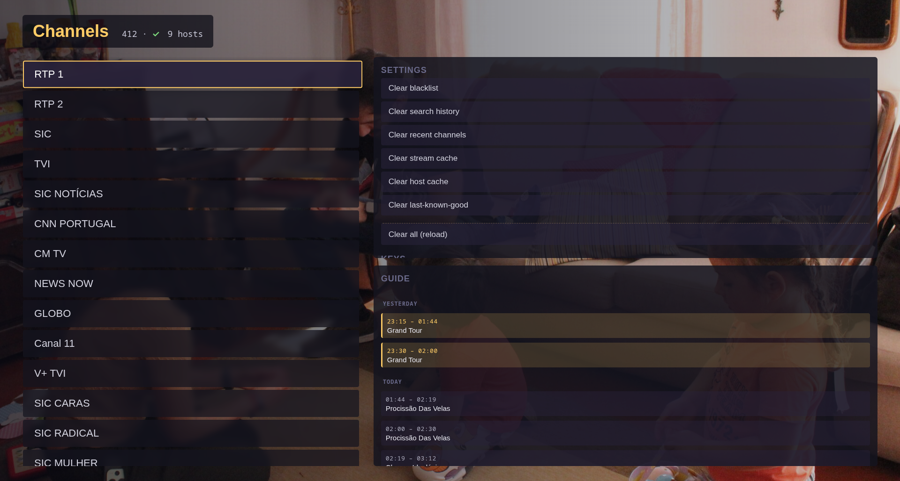

# iptv

Self-hosted IPTV stack for LG webOS: a thin TV app and a Rust proxy that aggregates Xtream Codes providers, dedupes channels, manages EPG, and fails over between sources.


## What is this

A two-piece IPTV setup I built for my LG OLED. Personal-scale, no ads, no telemetry, no analytics. The TV runs a small webOS app written in vanilla JavaScript — no framework, no build step. Everything that needs to think (Xtream auth, host probing, deduplication, EPG aggregation, source failover, segment proxying) lives in a Rust backend you run on a box in your LAN. The TV just renders.

Built and tested against the LG OLED B4 (webOS 9.2.4). Should work on most modern LG TVs running webOS in developer mode.

## How it works

```
┌──────────────┐   HTTP   ┌──────────────────┐   HTTP   ┌────────────────────┐
│ webOS TV app │ ───────▶ │  iptv-proxy      │ ───────▶ │  Xtream provider   │
│ (app/, JS)   │ ◀─────── │  (server/, Rust) │ ◀─────── │  (multiple hosts)  │
└──────────────┘  m3u8/ts └──────────────────┘  m3u8/ts └────────────────────┘
                                  │
                           probe / dedup / EPG / blacklist
```

- **`app/`** — webOS application. Talks to the proxy over HTTP, renders the channel list and the player, handles the remote. ~50 KB of JS, zero dependencies.
- **`server/`** — `iptv-proxy`, a Rust HTTP service (axum + reqwest). Probes Xtream hosts in parallel, builds a canonical channel catalog, serves EPG, proxies live segments with retries, and tracks per-URL / per-host health so dead sources get pushed to the back.

## Features

- Parallel multi-host probing with first-alive-wins boot
- Canonical channel deduplication across providers (prefers RAW / 4K / FHD / HD, in that order)
- EPG with multi-source merge, including catch-up (`tv_archive`) support
- Sequential source failover at play time, with per-URL blacklist + per-host demote on repeated failures
- Client-driven feedback: the TV reports the URL it just failed on, the server learns
- Hold-to-scroll with acceleration (380 ms → 45 ms over ~1.5 s)
- Instant render from cache on boot — no spinners
- Laptop development via a tiny Python dev server + Playwright
- CDP-based self-test loop for driving the running app on the TV from your shell

## Screenshots

| Channel list | Mini overlay while playing |
| :---: | :---: |
|  |  |
| **Multi-day EPG with catch-up** | **Fullscreen playback** |
|  |  |

## Quickstart — backend

You need Docker, an Xtream Codes account, and a host that's reachable from your TV's LAN.

```bash
cp server/config.example.toml server/config.toml
# Edit server/config.toml — fill in [xtream] username, password, and hosts.
docker compose up -d

curl http://localhost:8080/api/status     # should return JSON with `hosts`, `catalog`, etc.
```

Configuration lives in `server/config.toml` (gitignored). The example file documents every section: which Xtream hosts to probe, how often, EPG TTL, blacklist thresholds, segment buffer sizes, etc.

## Quickstart — TV app

Prereqs:
- LG TV in Developer Mode (and ideally Homebrew Channel for permanence)
- `ares-cli`: `npm i -g @webosose/ares-cli`
- `~/.webos/ose/novacom-devices.json` populated by LG webOS Studio / Dev Manager
- `rsync`, `scp`, `python3`

```bash
cp app/js/config.example.js app/js/config.js
# Edit app/js/config.js — set PROXY_BASE_URL to your iptv-proxy LAN address.

make setup     # one-time: derive ~/.ssh/lgtv_dev from novacom-devices.json
make deploy    # ~2 s: ares-package → scp IPK → luna install → launch
```

The remote-key bindings are listed in [`CLAUDE.md`](CLAUDE.md#laptop-keys). Yellow opens search, Red toggles pinned channels, Blue cycles settings panels, the rest is standard.

## Develop without a TV

For pure-UI work (layout, sort, EPG panel, mini ↔ fullscreen transitions) you can drive the app on your laptop. Much faster than the TV deploy cycle.

```bash
make serve         # serves app/ on http://localhost:8000 with cache-busting
```

Drive Chromium via Playwright. Real Xtream data flows through (the proxy allows CORS from `localhost`). The one thing that doesn't work locally is HLS playback — Chromium has no native HLS decoder, so video pixels only show up after a real TV deploy.

For the **self-test loop on a running TV** (CDP tunnel + `tv-eval` / `tv-key` / `tv-shot` / `tv-log` scripts that let you drive the app from your shell and screenshot the webview), see [`CLAUDE.md`](CLAUDE.md#self-test-loop-the-killer-workflow).

## HTTP API (proxy)

| Method | Path | Purpose |
|---|---|---|
| `GET`  | `/api/channels` | Canonical channel list with play URLs and catch-up metadata |
| `GET`  | `/api/epg/:key` | EPG for a channel — server walks all sources in parallel |
| `GET`  | `/api/status` | Hosts / catalog / EPG / blacklist health |
| `POST` | `/api/feedback/:key` | Client tells the server a play failed (`{"kind":"fail"}`) or should be demoted (`{"kind":"demote"}`) |
| `POST` | `/admin/reprobe` | Force a host reprobe + catalog refresh |
| `POST` | `/admin/clear-blacklist` | Forget all per-URL / per-host failures |
| `POST` | `/admin/clear-demoted` | Promote demoted URLs back to normal priority |
| `POST` | `/admin/clear-all` | Clear blacklist + demoted + last-known-good |
| `GET`  | `/play/:name` | HLS playlist proxy for a channel key |
| `GET`  | `/seg/:token` | Opaque-token segment proxy used by the playlist |

## Layout

```
app/                  packaged into the IPK
  appinfo.json        webOS manifest
  index.html          entry
  bg.jpg              wallpaper
  icon.png largeIcon.png
  css/app.css
  js/
    main.js           entry — state, render, remote handlers, boot flow
    api.js            thin fetch wrapper around the proxy
    remote.js         LG remote key handlers + hold-to-repeat
    player.js         single <video>, multi-source sequential failover
    cache.js          localStorage
    config.js         (gitignored — copy from config.example.js)

server/               Rust proxy (axum + tokio + reqwest)
  src/
    main.rs           router + probe / catalog loops
    api.rs            HTTP handlers
    xtream.rs         Xtream Codes API client
    hosts.rs          parallel host probing
    canonical.rs      dedup + variant ranking
    catalog.rs        cached canonical channel list
    epg.rs            EPG aggregation across sources
    blacklist.rs      URL / host failure tracking
    proxy.rs          playlist + segment proxy with retries
    default_order.rs  curated default channel ordering
    config.rs state.rs
  Cargo.toml Dockerfile
  config.example.toml example proxy config
  tests/e2e.py        end-to-end Python test

scripts/              dev tooling
  setup-key           one-time: build ~/.ssh/lgtv_dev from novacom-devices.json
  tv-ssh tv-tunnel    SSH and CDP forwarding helpers
  tv-eval tv-key tv-shot tv-log   drive the running app from your shell
  dev-serve           Python HTTP server for laptop development
  deploy              ares-package + scp + luna install + launch

docker-compose.yml    runs server/ as a container
Makefile              deploy / launch / close / ssh / logs / clean / serve
```

## Quirks worth knowing

A few things bit me on the way; full details with diagnostic recipes in [`CLAUDE.md`](CLAUDE.md#known-quirks):

- **`max-activated-media-players=1`** on webOS — parallel racing for the fastest source hangs the renderer. Sequential failover only.
- **HLS MIME on webOS** — `application/vnd.apple.mpegurl` fails; `application/x-mpegURL` works. Plain `video.src = url` works for `.m3u8` and `.ts`.
- **CORS on stream URLs** — cross-origin manual-redirect fetches return `opaqueredirect` with the Location header stripped. Bad hosts are detected at play time, not at boot.
- **Cloudflare abuse-page hosts** — some providers auth fine but their stream URLs redirect to `cloudflare-terms-of-service-abuse.com`. The blacklist catches these after 4 distinct stream failures on the same host.

## License

[PolyForm Noncommercial 1.0.0](LICENSE). Source-available — free to use, study, modify, and share for any non-commercial purpose. Commercial use is not granted by this license.
